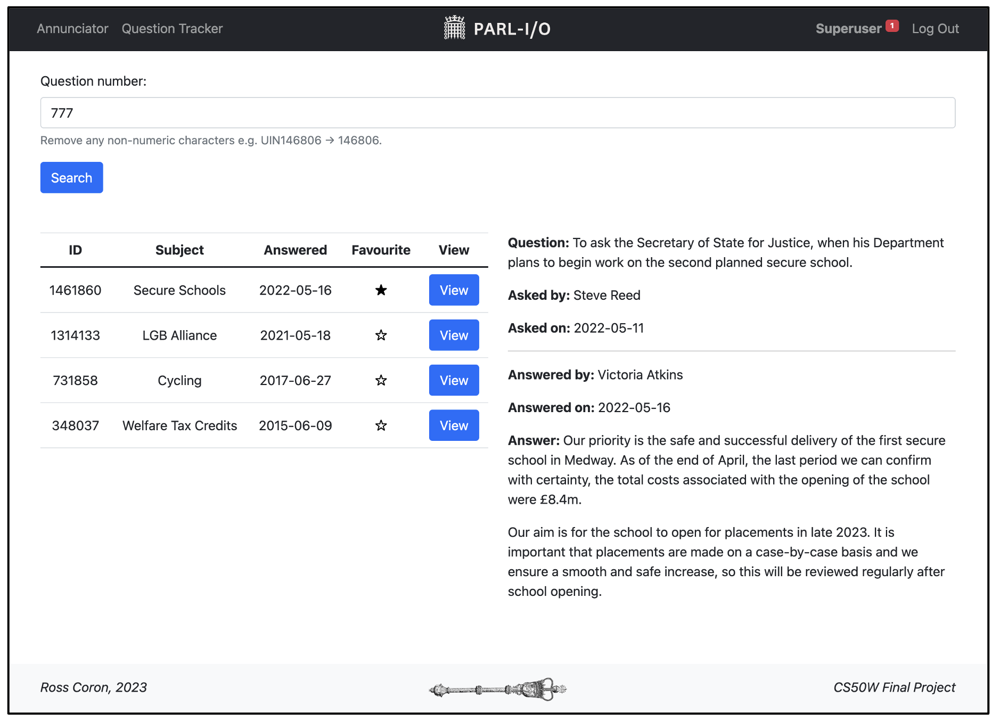

# Parl-I/O

Hello World! 

Welcome to Parl-I/O ('*Parlio*'), designed and implemented as my final project for Harvard's [CS50 Web Programming with Python and JavaScript](https://cs50.harvard.edu/web/2020/). Parl-I/O is a web application written primarily in Python and JavaScript.

Making use of the [UK Parliament](https://www.parliament.uk/)'s public API, Parl-I/O provides the real-time sitting status of both the House of Commons and House of Lords, allows users to search and view [written Parliamentary questions](https://questions-statements.parliament.uk/) (PQs), bookmark questions for later viewing, and set up notifications for unanswered questions. Parl-I/O additionally provides basic user-handling, allowing visitors to safely create an account for the application as well as log in / out functionality.

## Backend

*Pending...*

## Et al.

*Pending...*
